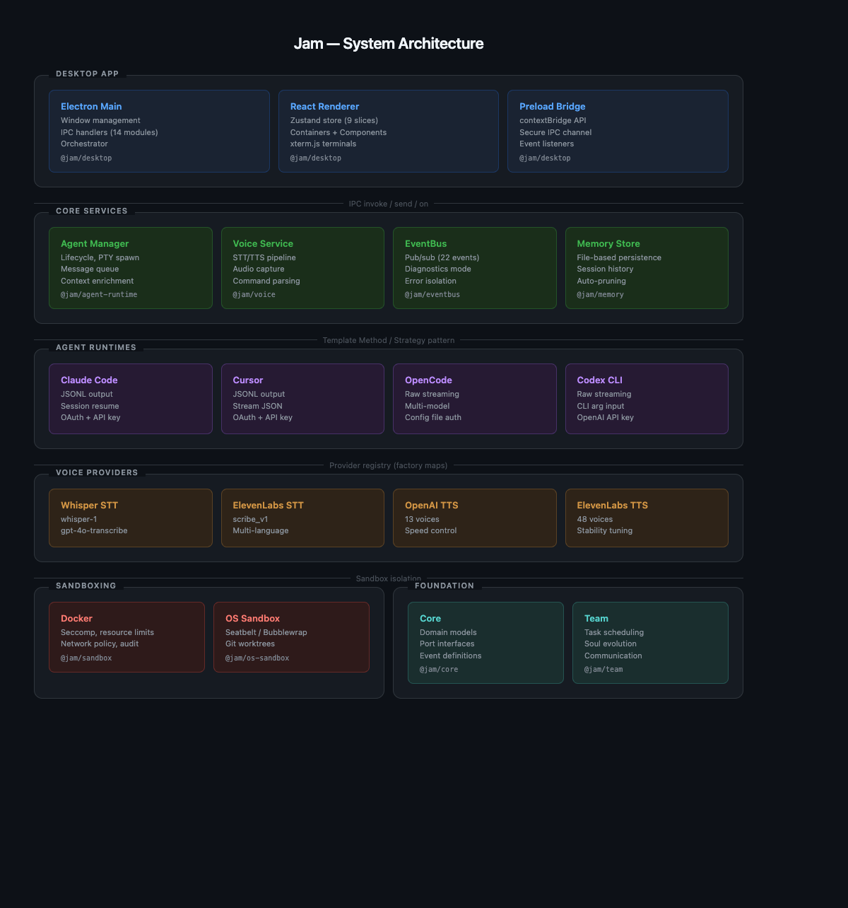
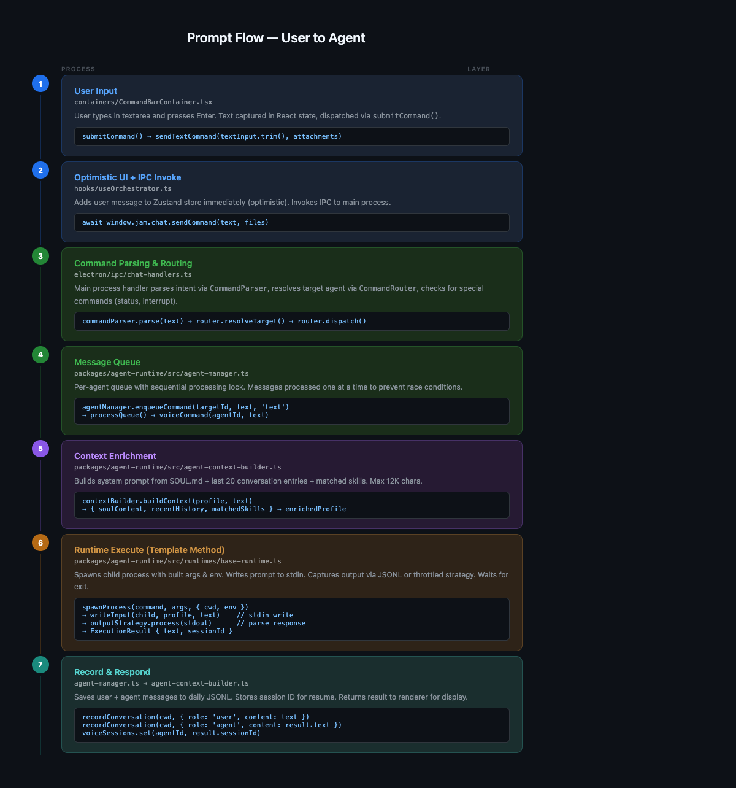
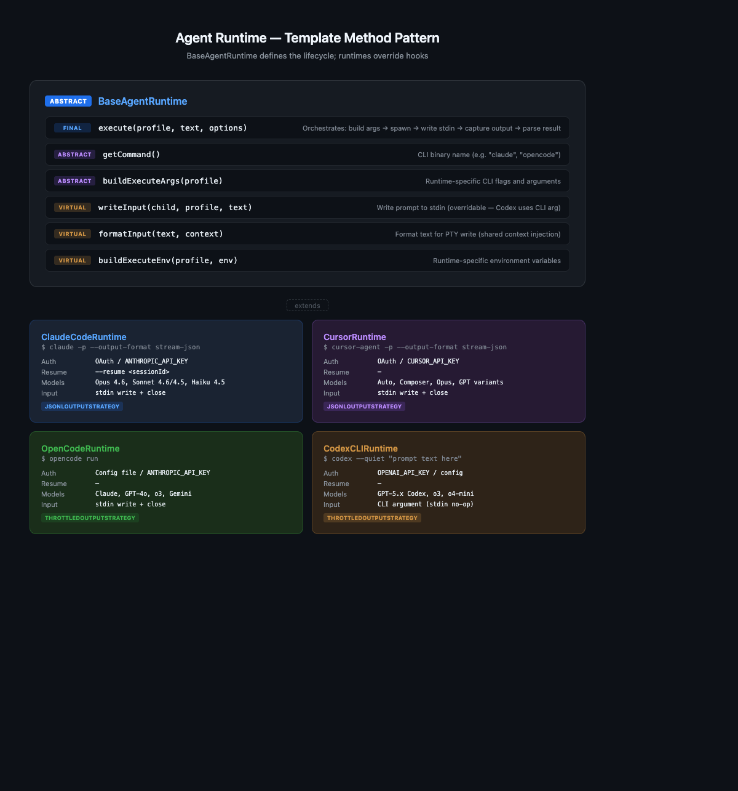
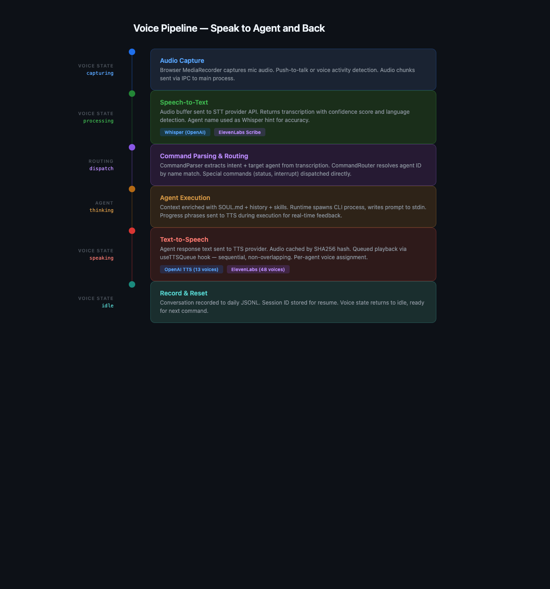
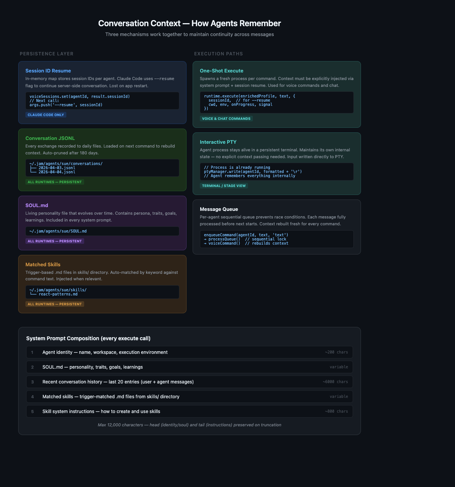

# Jam Architecture

Detailed technical documentation for the Jam AI Agent Orchestrator.

## System Overview

<p align="center">
  
</p>

Jam is a Yarn 4 monorepo (`nodeLinker: node-modules`, `nmMode: hardlinks-local`) requiring Node.js >= 22. The system is composed of 10 packages organized in three tiers: the desktop application, core services, and infrastructure.

## Desktop Application

**Package:** `@jam/desktop` (Electron 40 + React 18 + Vite 7)

### Main Process

The Electron main process is organized around an Orchestrator that wires all services together:

```
electron/
├── main.ts              # Window creation, lifecycle, IPC registration
├── orchestrator.ts       # Service wiring, dependency injection, factory maps
├── command-router.ts     # Voice/text command routing with handler registry
├── preload.ts            # contextBridge → window.jam API
├── ipc/                  # 14 domain-specific IPC handler modules
│   ├── agent-handlers.ts
│   ├── terminal-handlers.ts
│   ├── voice-handlers.ts
│   ├── chat-handlers.ts
│   ├── config-handlers.ts
│   ├── window-handlers.ts
│   ├── setup-handlers.ts
│   ├── service-handlers.ts
│   ├── task-handlers.ts
│   ├── team-handlers.ts
│   ├── brain-handlers.ts
│   ├── sandbox-handlers.ts
│   ├── auth-handlers.ts
│   └── update-handlers.ts
└── utils/
    └── path-fix.ts       # PATH fixup for macOS/Linux GUI apps
```

Each IPC handler module exports:
- A narrow `XxxHandlerDeps` interface — only what that handler needs
- A `registerXxxHandlers(deps)` function

The Orchestrator is **never** passed directly to handlers. Instead, `main.ts` destructures specific deps:

```typescript
registerAgentHandlers({
  runtimeRegistry: orchestrator.runtimeRegistry,
  agentManager: orchestrator.agentManager,
});
```

### Renderer Process

Built with React 18 + Zustand + TailwindCSS:

```
src/
├── App.tsx               # Pure layout component (~108 lines)
├── constants/
│   └── provider-catalog.ts  # Single source of truth for models/voices
├── hooks/
│   ├── useTTSQueue.ts       # TTS audio queue (sequential playback)
│   ├── useIPCSubscriptions.ts  # All IPC event subscriptions
│   ├── useOrchestrator.ts   # Chat/voice command dispatch
│   ├── useAgent.ts          # Agent state management
│   ├── useAgentTerminal.ts  # Terminal session handling
│   ├── useVoice.ts          # Voice recording/transcription
│   └── ...
├── containers/           # Zustand-connected components
├── components/           # Pure presentational components
└── store/                # 9 Zustand slices
```

**Zustand Store Slices:**

| Slice | Responsibility |
|-------|---------------|
| `agentSlice` | Agent profiles, status, visual states |
| `terminalSlice` | PTY session data, output buffer |
| `voiceSlice` | Recording state, transcription, TTS queue |
| `chatSlice` | Messages, threads, history |
| `taskSlice` | Tasks, scheduling, assignment |
| `teamSlice` | Agent relationships, trust scores |
| `settingsSlice` | User preferences (voice, models, appearance) |
| `notificationSlice` | Toast notifications, alerts |

### IPC Communication

- `ipcRenderer.invoke` — Request/response (agents:list, config:get, etc.)
- `ipcRenderer.send` — Fire-and-forget (voice:audioChunk, voice:ttsState)
- `createEventListener` helper — Event streams with automatic cleanup

## Prompt Flow

<p align="center">
  
</p>

### Step-by-step

1. **User Input** (`CommandBarContainer.tsx`) — Textarea captures input, Enter triggers `submitCommand()` → `sendTextCommand(text)`
2. **Optimistic UI + IPC** (`useOrchestrator.ts`) — Adds user message to Zustand store immediately, invokes `window.jam.chat.sendCommand(text)`
3. **Command Parsing** (`chat-handlers.ts`) — `CommandParser.parse()` extracts intent, `CommandRouter.resolveTarget()` finds the agent, checks for special commands (status, interrupt)
4. **Message Queue** (`agent-manager.ts`) — `enqueueCommand()` pushes to per-agent queue with sequential processing lock
5. **Context Enrichment** (`agent-context-builder.ts`) — Builds system prompt from SOUL.md + last 20 conversation entries + matched skills (max 12K chars)
6. **Runtime Execute** (`base-runtime.ts`) — Spawns child process, writes prompt to stdin, captures output via JSONL or throttled strategy
7. **Record & Respond** — Saves exchange to JSONL, stores session ID, returns result to renderer

### Two Execution Paths

| Path | When | How |
|------|------|-----|
| **One-Shot Execute** | Voice/chat commands | Spawns fresh process, injects context via system prompt + session resume |
| **Interactive PTY** | Terminal/Stage view | Process stays alive, maintains internal state, input written to PTY |

## Agent Runtime Architecture

<p align="center">
  
</p>

### BaseAgentRuntime (Template Method)

`BaseAgentRuntime` defines the shared `execute()` lifecycle. Subclasses override hooks:

| Method | Type | Purpose |
|--------|------|---------|
| `execute()` | Final | Orchestrates: build args → spawn → write stdin → capture output → parse result |
| `getCommand()` | Abstract | CLI binary name (e.g. `claude`, `opencode`) |
| `buildExecuteArgs()` | Abstract | Runtime-specific CLI flags |
| `writeInput()` | Virtual | Write prompt to stdin (Codex overrides to no-op) |
| `formatInput()` | Virtual | Format text for PTY write (shared context injection) |
| `buildExecuteEnv()` | Virtual | Runtime-specific environment variables |

### Output Strategies

| Strategy | Description | Used by |
|----------|-------------|---------|
| `JsonlOutputStrategy` | Line-buffered JSONL parsing | Claude Code, Cursor |
| `ThrottledOutputStrategy` | Raw streaming chunks | OpenCode, Codex CLI |

### Runtime Details

**Claude Code** — The only runtime with session resume (`--resume <sessionId>`). Uses OAuth or `ANTHROPIC_API_KEY`. Supports Claude Opus 4.6, Sonnet 4.6/4.5, Haiku 4.5.

**Cursor** — Uses `cursor-agent` CLI with `stream-json` output format. Supports Auto, Composer, and GPT model variants.

**OpenCode** — Uses `opencode run` CLI. Supports Claude, GPT-4o, o3, and Gemini models. Auth via config file or env vars.

**Codex CLI** — Unique: passes prompt text as a CLI argument (not stdin). Uses `OPENAI_API_KEY`. Supports GPT-5.x Codex variants.

## Voice Pipeline

<p align="center">
  
</p>

### Voice States

`idle` → `capturing` → `processing` → `speaking` → `idle`

### STT Providers

| Provider | Models | Features |
|----------|--------|----------|
| **OpenAI Whisper** | whisper-1, gpt-4o-transcribe, gpt-4o-mini-transcribe | Language detection, no-speech probability, agent name hint |
| **ElevenLabs Scribe** | scribe_v1, scribe_v1_experimental | Multi-language support |

### TTS Providers

| Provider | Voices | Features |
|----------|--------|----------|
| **OpenAI TTS** | 13 (Alloy, Ash, Ballad, Cedar, Coral, Echo, Fable, Marin, Nova, Onyx, Sage, Shimmer, Verse) | Speed control (0.25-4.0x), MP3 output |
| **ElevenLabs TTS** | 48 voices | Speed, stability, similarity boost, eleven_multilingual_v2 model |

### Audio Caching

TTS responses are cached by SHA256 hash (including speed parameter). Cached audio is replayed without re-calling the API.

### Progress Phrases

During agent execution, the Orchestrator matches tool-use patterns against a phrase registry and sends interim TTS updates:

```typescript
{ pattern: /bash|command|shell/i, phrase: 'Running a command.' },
{ pattern: /write|edit|create/i, phrase: 'Writing some code.' },
```

## Conversation Context

<p align="center">
  
</p>

### Three Mechanisms

1. **Session ID Resume** (Claude Code only) — In-memory `voiceSessions` map stores session IDs. On next command, `--resume <id>` continues the server-side conversation. Lost on app restart.

2. **Conversation JSONL** (all runtimes) — Every user/agent exchange recorded to `~/.jam/agents/<name>/conversations/<date>.jsonl`. Last 20 entries loaded and injected into the system prompt. Auto-pruned after 180 days.

3. **SOUL.md + Skills** (all runtimes) — Living personality file and trigger-matched skill `.md` files included in every system prompt.

### System Prompt Composition

On every `execute()` call, the system prompt is composed from (in order):

1. Agent identity — name, workspace, execution environment (~200 chars)
2. SOUL.md — personality, traits, goals, learnings (variable)
3. Recent conversation history — last 20 entries (~6000 chars)
4. Matched skills — trigger-matched `.md` files from `skills/` (variable)
5. Skill system instructions (~800 chars)

**Max total: 12,000 characters.** On truncation, head (identity/soul) and tail (instructions) are preserved.

## EventBus

**Package:** `@jam/eventbus`

In-process pub/sub with error isolation (handler exceptions don't crash the event loop).

### Events (22 total)

| Category | Events |
|----------|--------|
| **Agent** | `created`, `deleted`, `statusChanged`, `visualStateChanged`, `output`, `input`, `acknowledged`, `responseComplete`, `progress`, `error`, `ready` |
| **Voice** | `transcription`, `stateChanged`, `tts:complete` |
| **Task** | `created`, `updated`, `completed`, `negotiated` |
| **Communication** | `message:received`, `blackboard:published` |
| **Other** | `trust:updated`, `soul:evolved`, `stats:updated`, `code:proposed/improved/failed/rolledback` |

## Sandbox & Isolation

### OS-Level Sandbox (`@jam/os-sandbox`)

- **macOS**: Seatbelt profiles with domain whitelist (18 allowed domains: Anthropic, OpenAI, ElevenLabs, GitHub, npm, PyPI, etc.)
- **Linux**: Bubblewrap with equivalent restrictions
- Deny-read: SSH keys, GPG, AWS credentials, gcloud config
- Deny-write: `.env`, `*.pem`, `*.key` files

### Docker Sandbox (`@jam/sandbox`)

- Container per agent with configurable CPU/memory/process limits
- Seccomp BPF syscall filtering
- Network policy: `unrestricted` or `host-bridge-only`
- Disk quota per container (overlay2)
- Port range allocation (default: 20 ports per agent)
- Audit logging (JSONL)
- Agent execution mode: `container` (docker exec) or `host` (native CLI)

### Git Worktree Isolation (`@jam/os-sandbox`)

- Auto-create git worktrees for agent workspaces
- Branch isolation per agent
- Merge status tracking: clean, ahead, behind, diverged, conflict

## Team Coordination (`@jam/team`)

- **TaskScheduler** — Cron-based task scheduling
- **SmartTaskAssigner** — Intelligent task distribution based on agent capabilities
- **TaskNegotiationHandler** — Reassign/block resolution
- **SoulManager** — Agent persona evolution with reflection and version tracking
- **FileCommunicationHub** — Channel-based messaging (team, direct, broadcast)
- **CodeImprovementEngine** — Automated refactoring with test validation and rollback

## Agent Domain Model

### Agent Profile

```typescript
{
  id, name, runtime, model,
  systemPrompt, color, avatarUrl,
  voice: { provider, voiceId, speed },
  cwd, env, secretBindings,
  flags: { autoStart, allowFullAccess, allowInterrupts, allowComputerUse, useWorktree },
  role: 'worker' | 'supervisor',
  isSystem: boolean
}
```

### Agent States

| Status | Visual States |
|--------|---------------|
| `stopped`, `starting`, `running`, `error`, `restarting` | `idle`, `listening`, `thinking`, `speaking`, `working`, `error`, `offline` |

### Task Model

```typescript
{
  id, title, description,
  status: 'pending' | 'assigned' | 'running' | 'blocked' | 'completed' | 'failed' | 'cancelled',
  priority: 'low' | 'normal' | 'high' | 'critical',
  source: 'user' | 'agent' | 'system' | 'schedule',
  dependsOn: string[],  // DAG dependencies
  assignedTo, createdBy, parentTaskId
}
```

## Security

- **Shell commands**: All use `execFileSync` with argument arrays (never string interpolation)
- **API keys**: Encrypted via `electron.safeStorage`
- **IPC**: `contextBridge` isolation — no direct Node.js access from renderer
- **Sandbox**: Three tiers of execution isolation (OS, Docker, Worktree)

## Provider Catalog

`apps/desktop/src/constants/provider-catalog.ts` is the single source of truth for all provider options:

- `STT_MODELS` — STT model options per provider
- `TTS_VOICES` — TTS voice options per provider
- `AGENT_MODELS` — Available models per runtime
- `AGENT_COLORS` — 19 preset agent colors

Three consumers: SettingsContainer, AgentConfigForm, OnboardingContainer.

## Build & Release

| Platform | Artifact | Notes |
|----------|----------|-------|
| macOS | DMG + ZIP | Signed + notarized (Developer ID), hardened runtime |
| Windows | NSIS installer + portable | |
| Linux | AppImage + deb | |

Auto-update via `electron-updater` with GitHub Releases.

CI/CD: GitHub Actions with reusable matrix build (`_build.yml`), staging (`build.yml`), and production (`release.yml`) workflows.

See [macOS Code Signing](macos-code-signing.md) for signing and notarization details.
